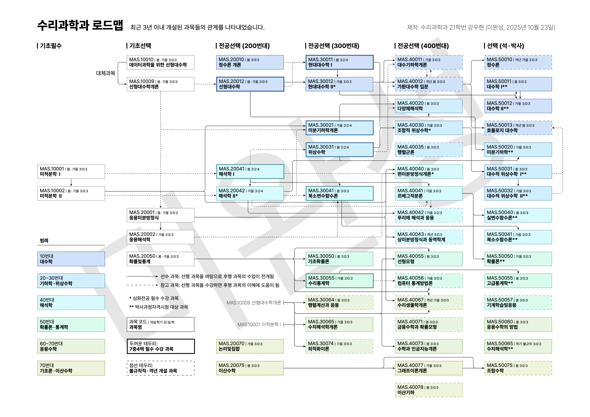

# KAIST-MathSci-SubjectsMap

KAIST 수리과학과의 개설 교과목을 내용과 수준, 선후 관계에 따라 맵으로 나타낸 것입니다. 인쇄용 버전과 웹 버전이 있으며, 웹 버전에서는 마우스를 원하는 과목에 올려 선후관계를 더 쉽게 볼 수 있습니다.

## 내용 보기

### 인쇄용 버전



### 웹 버전

[여기](https://kangwh.github.io/KAIST-MathSci-SubjectsMap)를 클릭하십시오.

## 소스 파일에서 컴파일하기

인쇄용 버전은 LaTeX과 TikZ/PGF로 작성되었습니다. TeX 배포판과 Pretendard 글꼴을 시스템에 설치한 뒤, 터미널에서
```
xelatex map
```
을 실행하면 PDF 파일이 생성됩니다.

## 주의 사항

이 맵은 아직 미완성입니다. 이 맵을 본인의 학습에 사용함으로써 발생하는 모든 책임은 본인에게 있습니다.

이 프로젝트는 개인이 진행하는 프로젝트로, 이 저장소의 모든 내용은 KAIST나 KAIST 수리과학과, 또는 수리과학과 학생회의 공식적인 의견이 아닙니다.
